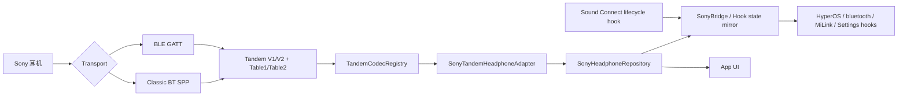

# SonyPods 当前架构

> 更新日期：2026-08-08。本文描述当前代码，不再描述早期 OppoPods → SonyPods 迁移阶段。

## 1. 总体结构



协议字节只应在 `protocol/` builder 中形成，经 codec 和 adapter 产生带 channel 的 `HeadphoneCommand`。UI、Hook 和 Repository 不应自行拼接 Tandem payload。

## 2. 进程与职责

| 区域 | 主要代码 | 职责 |
|---|---|---|
| Transport | `ble/SonyBleClient.kt`、`SonySppTransport.kt` | 扫描、连接、GATT 握手、SPP frame、写队列、超时与重试 |
| Protocol | `protocol/SonyTandemV*Protocol.kt` | DataType、Command、InquiredType、builder、typed parser |
| Codec | `headphones/TandemCodecRegistry.kt` | 按 V1/V2 × Table1/Table2 选择协议实现并暴露 typed 操作 |
| Adapter | `headphones/SonyTandemHeadphoneAdapter.kt` | 功能到 variant/channel/query/write type 的绑定，生成命令和解析路由 |
| Capability | `headphones/SonyCapabilityProbe.kt` | 解析 support function，构建域 capability probe，推导设备能力 |
| State/API | `data/SonyHeadphoneRepository.kt` | 连接状态、能力缓存、产品 setter/query、响应合并和 UI state |
| Cross-process | `bridge/`、`hook/` | 将耳机状态和操作桥接到 HyperOS 系统进程及系统 UI，并处理 Sound Connect 的连接让权 |
| UI | `ui/` | 展示状态并调用 Repository 的产品级 API |

## 3. Sound Connect 连接让权

`com.sony.songpal.mdr` 在 Xposed 作用域内由 `SoundConnectHandoverHook` 协调官方 App 对 Tandem 的多来源持有：

1. Activity 创建/可见、`KeepConnectionForegroundService` 运行、或官方 MDR connection controller 中仍存在实际 session，任一条件成立即通过 `SonyBridge` 向 `com.android.bluetooth` 发送 `official_app_acquire`；
2. `SonyEngineHost` 设置官方 App 独占状态，断开 SonyPods Tandem session，并阻止 A2DP 回调、手动命令和 15 秒 `reconcileConnection()` 自愈任务重新抢占；
3. 所有持有来源均消失后进入 2 秒可取消宽限期。新 Activity、后台保活服务或 MDR session 在此期间出现会取消 release，从而避免 Activity 页面切换和官方内部 session 迁移产生瞬时抢连；
4. 宽限期结束后发送 `official_app_release`，引擎绕过正常 10 秒连接冷却并立即发起恢复；
5. acquire 同时携带官方 App 进程创建的 Binder token。若 App 崩溃或被强杀，`IBinder.DeathRecipient` 直接触发 release；
6. 若 `com.android.bluetooth` 在租约期间重启，引擎发送 `engine_ready`；只要仍有持有来源或正在宽限期内，官方 App Hook 就立即重申当前租约，避免重启后误抢连接。

官方 13.2.1 的实际 session 检测基于其混淆 connection controller，安装失败时会自动降级为稳定类名的 Activity + `KeepConnectionForegroundService` 生命周期，不会导致整个 Hook 失效。由于本模块只面向 Android 15/HyperOS，租约统一使用该平台实际可用的校验方式：官方进程 UID/package 声明由引擎通过 PackageManager 核验，并同时检查明确目标包、lease ID 和 Binder 存活性；普通命令不进入租约校验。该机制不轮询 Sound Connect 的进程或前后台状态。15 秒 reconcile 仍只负责 SonyPods 自身连接自愈，并在官方 App 持有租约期间无条件跳过。

## 4. 协议选择

项目使用四种 `HeadphoneProtocolVariant`：

- `SONY_TANDEM_V1_TABLE1`
- `SONY_TANDEM_V1_TABLE2`
- `SONY_TANDEM_V2_TABLE1`
- `SONY_TANDEM_V2_TABLE2`

默认 GATT channel：

| Variant | 默认 channel |
|---|---|
| V1 Table1 | `GATT_V1_MC` |
| V1 Table2 | `GATT_V1_MC` |
| V2 Table1 | `GATT_V2_HPC` |
| V2 Table2 | `GATT_V2_MC` |

SPP 使用统一 `SPP_MDR` channel，由 `SonySppPayloadMapper` 在 Tandem 内部 marker 与 SPP 外层 frame type 之间转换。一个设备的不同功能可以通过 `featureProtocolMap` / `FeatureProtocolBinding` 绑定到不同 variant 和 channel，不能假定整台设备只使用一张表。

## 5. 能力驱动

连接后优先使用真实协议证据，而不是型号名猜测：

1. endpoint/service 决定可用 transport 和初始 variant；
2. 查询 protocol/capability/support function；
3. `SonyCapabilityProbe` 将 FunctionType 映射为域 capability 请求；
4. 由响应和 support function 生成 `HeadphoneCapabilities`、query type 和 writable type；
5. 按设备地址缓存 capability counter 与 function list；
6. counter 未变化时恢复缓存，变化时重新探测。

型号只用于识别、显示、图片和必要 quirk。仅在没有动态证据时才允许保守 fallback；fallback 不应开放未经确认的写操作。

## 6. 当前产品 API

`SonyHeadphoneRepository` 当前直接提供：

- 扫描、连接、断开；
- 降噪 / 环境声 / 环境声等级 / 人声模式；
- EQ 预设、自定义频段、Clear Bass；
- 上一首、播放/暂停、下一首；
- 原始 HEX 调试发送；
- 状态读取与合并：设备信息、电量、NC/ASM、EQ、播放、部分 LE Audio、Quick Access、佩戴状态、Table2 diagnostics。

关机、自动待机、充电保护、语音提示、多设备管理等尚未形成产品 API，具体状态见 [耳机命令目录](HEADPHONE_COMMAND_CATALOG.md)。

## 7. 扩展边界

新增协议功能必须遵循：

```text
FunctionType / InquiredType
  -> typed request/response
  -> protocol builder/parser
  -> TandemCodec
  -> adapter + channel binding
  -> repository state/API
  -> UI/bridge（如需要）
  -> capability gating + tests
```

只新增常量、枚举、通用 parser 或调试页 raw send，均不能计为功能已接入。完整流程见 [协议功能扩展指南](PROTOCOL_EXTENSION_GUIDE.md)。
