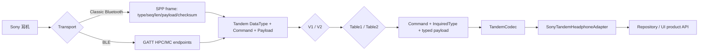

# Sound Connect 13.2.1 Sony 耳机协议审计与修复状态

> 审计日期：2026-08-08
> APK：`D:\mercu\Desktop\apk\Sound Connect_13.2.1.apks`
> APK 包：`com.sony.songpal.mdr`，`versionName=13.2.1`，`versionCode=130215029`
> SDK：`minSdk=30`，`targetSdk=36`
> APKS 大小：`92,398,567` bytes
> SHA-256：`692D9BD1F70B739755DD2533492B5AE916F771727E3386C5C2FC9E0FBA7DB673`
> 初始对比 commit：`3e5dcb206d36a50c3e48c8745c8022528ce27d07`
> 修复状态：报告中的 P1/P2 transport、FunctionType 和 Table 路由问题已于同日修复并通过 321 项单测；功能扩展仍未实施。
> 逆向方式：已连接 JADX GUI 的 `jadx-mcp-server 6.4.0`，对当前打开的 Sound Connect 13.2.1 进行静态反编译、类源码读取和调用链交叉引用。

## 0. 报告边界与证据优先级

本报告保留 2026-08-08 对 Sound Connect 13.2.1 与初始 SonyPods commit 的完整审计清单，并同步记录随后完成的协议正确性修复。当前实现说明以 [协议实现现状](PROTOCOL_IMPLEMENTATION.md) 为准；扩展规划以 [耳机命令目录](HEADPHONE_COMMAND_CATALOG.md) 为准。

出现冲突时，优先级为：

1. Sound Connect 13.2.1 的 JADX MCP 调用链与实机抓包；
2. 当前 Kotlin 源码及 byte-level 测试；
3. `docs/` 中标注当前状态的文档；
4. 历史提交或旧笔记。

特别说明：APK 内的 Tandem 命令覆盖 Sony 耳机、音箱、Party/DJ/Karaoke、灯光、Fiestable、更新和日志等多个产品域。附录保留 APK 的完整枚举，但正文将“Sony 全生态命令”与“耳机产品功能”分开，避免把音箱/派对功能误报为 SonyPods 缺陷。

JADX 原始证据和自动 inventory 位于 `build/jadx_mcp/`（该目录被 Git 忽略），关键文件：

- `protocol_inventory.json`：四套 Command、V1/V2 FunctionType、45 套 InquiredType、协议版本白名单及项目启发式覆盖统计；
- `sources/`：通过 MCP 抓取的反编译类源码；
- `command_lists.txt`、`inquired_lists.txt`：自动展开的原始清单。

## 1. 结论摘要

SonyPods 已正确实现 Tandem 的总体架构和主要耳机控制域，包括 V1/V2、Table1/Table2 模型、SPP/GATT transport、协议版本白名单，以及电量、EQ/Clear Bass、NC/ASM、播放控制、部分 LE Audio、Quick Access 和佩戴状态。

初始审计发现的以下正确性问题已经修复：

1. V1/V2 FunctionType 错码和必要缺项；
2. V1 Table2 内部 marker 改为 `DATA_MDR_NO2 / 0x0F`；
3. NC/ASM `0x02` 按 V1/V2 上下文解析；
4. V2 Table2 LEA `0x04` 和 Party `0x05` 枚举；
5. BLE 严格等待 `DETERMINE_MTU=[0x01]`，按 enable/wait/disable/read 顺序握手；
6. BLE `WRITE_TYPE_NO_RESPONSE`、各阶段 timeout、旧 GATT callback 隔离、严格 writable length 和长度限制；
7. SPP 普通/大包 retry 策略、保持原 frame/sequence 重传和连续 RX sequence 去重。

修复后 `testDebugUnitTest` 为 `321 tests, 0 failures, 0 skipped`。当前主要缺口不再是 transport 正确性，而是功能纵向覆盖：V1/V2 Table2 仍以常量镜像、通用构建和诊断解析为主；关机、自动待机、Caring Charge、Voice Guidance、pairing/source switching、Safe Listening、assignable/gesture/assistant 等尚未形成完整 typed codec、adapter 和产品 API。

协议版本白名单与 Sound Connect 13.2.1 完全一致：V1 9 项、V2 74 项。

## 2. 协议栈分层



对比时必须区分以下层级：

1. APK Command 枚举是否存在；
2. 项目是否有 command byte 常量；
3. 是否有通用 frame/parser；
4. 是否有 typed payload parser；
5. 是否有 builder；
6. 是否经 `TandemCodec` 暴露；
7. adapter 是否实际调用；
8. 是否有最终产品 setter/query。

本报告中的 `code+operation represented` 只是“项目里能找到相同 code 和操作名”的启发式统计，**不能解释为功能/API 覆盖率**。

## 3. Transport：SPP

### 3.1 UUID

| 用途 | Sound Connect 13.2.1 | SonyPods | 结论 |
|---|---|---|---|
| Tandem V1 SPP | `96CC203E-5068-46AD-B32D-E316F5E069BA` | 相同 | 一致 |
| Tandem V2 SPP | `956C7B26-D49A-4BA8-B03F-B17D393CB6E2` | 相同 | 一致 |
| marker/辅助 UUID | `443cce33-e85d-4b85-8d53-6e319ede53ae` | 已识别 | 一致 |

APK 证据：`ie0.C18016i`。项目按实际绑定的 V1/V2 SPP UUID 选择协议版本，方向正确。

### 3.2 外层 SPP DataType 与项目内部 marker

这两层数值不能直接比较：

| 语义 | APK SPP 外层 DataType | SonyPods 内部 Tandem marker | mapper 后外层类型 |
|---|---:|---:|---:|
| Table1 MDR | `DATA_MDR=0x0C` | `DATA_MDR=0x0E` | `0x0C` |
| Table2 MDR | `DATA_MDR_NO2=0x0E` | `DATA_MDR_NO2=0x0F` | `0x0E` |
| Table1 shot | `SHOT_MDR=0x1C` | 归一化为 Table1 marker | `0x1C` |
| Table2 shot | `SHOT_MDR_NO2=0x1E` | 归一化为 Table2 marker | `0x1E` |
| large data | `LARGE_DATA_MDR=0x2C` | 归一化为 Table1 marker | `0x2C` |
| ACK | `0x01` | 不进入 Tandem parser | `0x01` |

项目映射实现：`app/src/main/java/dev/sonypods/ble/TandemTransportRouting.kt`。

### 3.3 SPP frame

APK 与项目一致的字节结构：

```text
0x3E
escaped(
    DataType       1 byte
    Sequence       1 byte
    PayloadLength  4-byte big-endian
    Payload        N bytes
    Checksum       1 byte
)
0x3C
```

- checksum：未转义 body 全部字节的 unsigned sum，取 `& 0xFF`；
- escape：`0x3C -> 0x3D 0x2C`，`0x3D -> 0x3D 0x2D`，`0x3E -> 0x3D 0x2E`；
- unescape：第二字节 `| 0x10`；
- ACK sequence：`1 - receivedSequence`。

APK 证据：`ne0.C24171b`、`ne0.AbstractC24170a`。项目：`SonySppTransport.encodeFrame` / RX parser。帧边界、长度、checksum、escape 和 inverse sequence 均一致。

### 3.4 SPP 可靠性：初始差异与修复后状态

下表保留初始对比 commit 的审计结果，不表示当前实现：

| 项目 | Sound Connect 13.2.1 | SonyPods 初始状态 | 初始风险 |
|---|---|---|---|
| 普通 MDR ACK timeout | `750 ms` | `1200 ms` | 单次等待更长不是主要问题 |
| 普通 MDR 超时重发 | `10` 次（不含首次） | `1` 次 | 更容易关闭 transport |
| LARGE_DATA_MDR timeout | `5000 ms` | 无独立策略，仍为 `1200 ms` | 大数据明显过早超时 |
| LARGE_DATA_MDR 重发 | `2` 次 | `1` 次 | 容错较弱 |
| 重复 RX sequence | 默认过滤；特定重发路径可放行 | 每次 ACK 后都 `onPayload` | 可能重复上报 response/notification |

APK 证据：`le0.C22925e.m89641k`、`ie0.C18010c`。初始项目证据：`SonySppTransport.kt` 与 `TandemTransportRouting.kt` 的修复前版本。

**修复后状态：**普通 `DATA_MDR` / `DATA_MDR_NO2` 使用 `750 ms + 10 retries`；`LARGE_DATA_MDR` 使用 `5000 ms + 2 retries`。重复 RX sequence 仍会收到 ACK，但连续重复帧只向 Tandem 上层分发一次。当前 wire format、重试策略和去重语义已与本次审计结论对齐。

## 4. Transport：BLE GATT

### 4.1 UUID 与 endpoint 路由

| 项目 | UUID |
|---|---|
| V2 HPC service | `5b833e20-6bc7-4802-8e9a-723ceca4bd8f` |
| V2 MC service | `5b833e21-6bc7-4802-8e9a-723ceca4bd8f` |
| V1 MC service | `5b833e23-6bc7-4802-8e9a-723ceca4bd8f` |
| HPC TO/FROM | `5b833c60-...` / `5b833c61-...` |
| MC TO/FROM | `5b833c62-...` / `5b833c63-...` |
| READY | `5b833c90-...` |
| WRITABLE_VALUE_LENGTH | `5b833c91-...` |
| DETERMINE_MTU | `5b833c93-...` |
| OPTIMAL_MTU | `5b833c94-...` |

项目的 V2 HPC/MC 与 V1 MC endpoint 发现和路由基本一致。`READY` 没有出现在 APK `je0.C19228a` 的 Tandem session 主流程中，因此不能据此要求项目在 Tandem 初始化中强制等待 READY。

### 4.2 Sound Connect 握手

`je0.C19228a` 的关键顺序：

1. 若通用 GATT 层尚未完成 MTU：
   - enable `DETERMINE_MTU` notify；
   - 等待 notification payload 为 `MtuStatus.MTU_IS_DETERMINED (0x01)`，timeout `10000 ms`；
   - disable notify；
   - 等待 disable callback，timeout `5000 ms`；
2. read `WRITABLE_VALUE_LENGTH`：2-byte big-endian，timeout `2000 ms`；
3. enable Tandem `FROM_ACC` notify，timeout `5000 ms`；
4. 写入完成/queue release timeout `500 ms`；
5. Tandem characteristic 写使用 write without response。

项目把 `OPTIMAL_MTU` read 和 Android `requestMtu` 内联到自己的状态机中，这一额外步骤本身不构成错误；真正差异是后续事件门控。

### 4.3 握手顺序：初始问题与修复后状态

初始对比 commit 中，`SonyBleClient.onDescriptorWrite` 在 `EnableDetermineMtu` descriptor 写成功后直接读取 `WRITABLE_VALUE_LENGTH`，导致正常路径没有等待真正的 `DETERMINE_MTU` characteristic notification；同时还存在 payload 校验、阶段 timeout、MTU callback 状态和 writable length 合法性校验不完整的问题。

**修复后状态：**当前状态机在 enable descriptor 成功后进入 `WaitDetermineMtu`，仅当 notification payload 严格匹配 `0x01` 才关闭通知并继续；enable/wait、disable、writable-length read、Tandem notify enable 和 write completion 均有对应 timeout。`onMtuChanged`、异步 callback 和 session generation 也会拒绝失败或过期会话继续推进。

### 4.4 BLE write type：初始差异与修复后状态

APK 调用链：

```text
je0.C19228a.m77674E
  -> p153fh.C16485c.m69487E
  -> InterfaceC16500r.mo69538d(..., false)
  -> p153fh.C16505w.mo69538d
  -> writeType = false ? 1 : 2
```

Android 常量中 `1=WRITE_TYPE_NO_RESPONSE`，`2=WRITE_TYPE_DEFAULT`，并且 `C19228a` 的 callback 命名也明确为 `onWriteWithoutResponse`。

初始对比 commit 使用 `WRITE_TYPE_DEFAULT`。**当前实现已在新旧 Android API 路径统一改为 `WRITE_TYPE_NO_RESPONSE`**，与 Sound Connect 的 Tandem characteristic 写语义一致。

### 4.5 writable length 与分块

应谨慎区分：APK `C19228a` 本身把传入 `byte[]` 整包写入 characteristic，没有在该类直接切块；但它读取并保存 `WRITABLE_VALUE_LENGTH`，通过 `C19229b.mo850j0() -> C19228a.m77693x()` 向上层暴露最大传输长度。

初始对比 commit 只保存该值而不限制发送长度。**当前实现要求 characteristic 返回严格的两字节大端值，并校验 `writable + 3 in 20..512`；发送前若 payload 超过 writable limit，会直接拒绝而不是静默截断或错误分块。**短控制命令已覆盖；未来若接入 FOTA、日志或其他 large payload，仍需为该业务单独设计并验证端到端分块协议，不能把 GATT write queue 当作 Tandem 分片协议。

## 5. Tandem DataType、版本与 Table

### 5.1 四个协议组合

| 组合 | APK Command 数 | 项目 protocol Byte 常量数 | 同 code+operation 启发式命中 | 实际产品层状态 |
|---|---:|---:|---:|---|
| V1 Table1 | 134 | 49 | 36 | 核心耳机域已 typed/接入，其他域大量缺失 |
| V1 Table2 | 22 | 21 | 19 | marker/route 已修复；protocol 有 generic builder/parser；codec parse-only；adapter 未接入 |
| V2 Table1 | 152 | 64 | 49 | 核心耳机域已 typed/接入，仍为部分覆盖 |
| V2 Table2 | 83 | 82 | 82 | 常量几乎完整，但 codec parse-only，adapter/API 基本未接入 |

V2 Table2 的 `82/83` 是最容易造成误判的数据：它只说明 command code 基本镜像，不代表 Safe Listening、Voice Guidance、pairing/source switching、Table2 System 等功能已经可用。

### 5.2 协议版本白名单

| 版本族 | APK | 项目 | 顺序 |
|---|---:|---:|---|
| V1 | 9 | 9 | 完全一致 |
| V2 | 74 | 74 | 完全一致 |

APK 证据：`p573uv.C29903d`、`p636wv.C30916e`。项目：`SonyTandemConstants.kt`。这是重要的一致项，不需要改动。

### 5.3 V1 Table2 DataType：初始 P1 与修复后状态

APK `com.sony.songpal.tandemfamily.message.mdr.p068v1.table2.C15179a.mo61820b()` 明确返回：

```java
return DataType.DATA_MDR_NO2;
```

APK transport bridge 也明确：

```text
MdrTable.TABLE1 -> DataType.DATA_MDR
MdrTable.TABLE2 -> DataType.DATA_MDR_NO2
```

初始对比 commit 的 `SonyTandemV1Table2Protocol.kt` 错误使用内部 `DATA_MDR`，会经 `SonySppPayloadMapper` 路由到 SPP Table1 外层 marker `0x0C`，而不是 Table2 外层 marker `0x0E`。

**修复后状态：**V1 Table2 现使用内部 `DATA_MDR_NO2 (0x0F)`；SPP outbound 映射为 `DATA_MDR_NO2 (0x0E)`，接收时恢复为内部 `0x0F`。builder、parser 和 transport route 已对齐 Table2。Table2 typed codec、adapter 和产品 API 仍未系统化接入，这属于后续功能扩展，不再是 marker 正确性问题。

## 6. FunctionType 对比

FunctionType 决定设备上报“支持哪些功能”，项目又据此生成探测命令和能力缓存，因此错码的影响通常高于单个 command 常量错误。

### 6.1 V1

以下数字是初始对比 commit 的审计快照：

- APK：39 项（含 `NO_USE` / sentinel）；
- 项目：34 项；
- 精确匹配：31；
- 缺失：5；
- 同名错码：2。

| 同名项 | APK wire code | 项目初始值 | 初始影响 |
|---|---:|---:|---|
| `BATTERY_LEVEL` | `0x11` | `0x02` | 官方 support-function 返回 `0x11` 时不能识别为基础电量 |
| `UPSCALING_INDICATOR` | `0x12` | `0x03` | 功能识别错误 |

初始缺失项：

```text
LEFT_RIGHT_CONNECTION_STATUS  0x17
CONCIERGE_DATA                 0x22
TANDEM_KEEP_ALIVE              0x23
VIBRATOR_ALERT_NOTIFICATION    0x92
ACTION_LOG_NOTIFIER            0xC1
```

**修复后状态：**上述两个错码和五个缺失项均已补正；V1 support-function 解码不再沿用修复前的错误编号。

### 6.2 V2

以下数字是初始对比 commit 的审计快照：

- APK：192 项，ordinal `0..191`，含 `NO_USE`；
- 项目：191 项，含自定义 `OUT_OF_RANGE`；
- 精确匹配：186；
- 同名错码：3；
- APK 名称缺失：2；项目额外名称：1。

| 同名项 | APK wire code | 项目初始值 | 初始影响 |
|---|---:|---:|---|
| `CONCIERGE_DATA` | `0x10` | `0x02` | support-function 解码错误 |
| `CONNECTION_STATUS` | `0x11` | `0x03` | 连接状态能力识别错误 |
| `CODEC_INDICATOR` | `0x12` | `0x04` | codec 指示能力识别错误 |

初始名称/上下文差异：

- `PAIRING_DEVICE_MANAGEMENT_WITH_BLUETOOTH_CLASS_OF_DEVICE_CLASSIC_BT` (`NO_2`, `0x32`)：项目使用缩短名，wire code 相同，属于命名差异；
- `HEAD_GESTURE_ON_OFF_TRAINING` (`NO_1`, `0xFF`)：初始实现没有该合法功能项，并把 `0xFF` 只作为 `OUT_OF_RANGE` 处理。

**修复后状态：**三个同名错码已修复；合法的 Table1 `HEAD_GESTURE_ON_OFF_TRAINING=0xFF` 已补齐。解析现在使用 `(table, code)` 联合上下文，能区分合法 `NO_1/0xFF`、其他表内合法 `0xFF` 与 `INVALID/OUT_OF_RANGE` sentinel。V2 Table2 的缺失功能枚举也已补齐。

## 7. InquiredType 对比

本次从 APK 恢复：

- 45 个 InquiredType enum class；
- 307 个 enum entry（包含 `NO_USE` / `OUT_OF_RANGE`）；
- 四表分布：V1 Table1 81、V1 Table2 4、V2 Table1 161、V2 Table2 61。

自动提取器已将反编译中的 `BSON.REGEX/REF/CODE/...` 常量还原为连续字节 `0x0B..0x12`；例如 `BSON.REGEX=0x0B`，因此附录不存在遗漏的静态初始化项。

初始审计确认的差异如下：

1. `NcAsmInquiredType` 中 V1 `V1_TABLE_SET1_NC_ASM` 与 V2 `NC_ON_OFF_AND_ASM_ON_OFF` 都使用 `0x02`，仅按 code 调用 `entries.firstOrNull` 会产生跨版本歧义；
2. V2 Table2 LEA 缺 `PAS_SUPPORTS_A2DP_LEA_UNI_LEA_BROAD_WITH_CTKD(0x04)`；
3. V2 Table2 Party 缺 `LIVE_KARAOKE(0x05)`；该项更偏 Sony Party 生态，是否产品化仍由项目范围决定；
4. 部分名称只是官方长名称的缩写，只要 table/code 相同，不属于 wire mismatch。

**修复后状态：**NC/ASM 已提供 V1 Table1 与 V2 Table1 分上下文解析入口，不再仅按裸 `0x02` 解析；V2 Table2 LEA `0x04` 与 Party `0x05` 已加入对应 InquiredType。这里的“已补齐”仅指协议枚举正确性，不代表 Party/Karaoke 等功能已接入 codec、adapter 或 UI。

## 8. 当前分层实现覆盖矩阵

| 层 | V1 T1 | V1 T2 | V2 T1 | V2 T2 |
|---|---|---|---|---|
| APK Command inventory | 134 | 22 | 152 | 83 |
| 通用 frame/parser | 有 | 有 | 有 | 有 |
| typed parser | 电量/EQ/NC/播放/连接等核心域 | 少量，主要诊断 | 电量/EQ/NC/播放/LEA/System 等核心域 | 少量，主要诊断 |
| protocol builder | 核心 GET/SET | generic builder/常量，未产品化 | 核心 GET/SET | generic builder/常量，未产品化 |
| `TandemCodec` 暴露 | 部分 typed | 基本 parse-only | 部分 typed | 基本 parse-only |
| adapter 实际 query/setter | 核心域 | 无系统化接入 | 核心域 | 无系统化接入 |
| transport 正确性 | SPP/GATT 已修复 | marker/route 已修复 | GATT/SPP 已修复 | GATT/SPP 已修复 |

`TandemCodec` 当前主要暴露 support/protocol/capability/device info、battery、EQ/EBB、NC/ASM、playback、V2 Table1 部分 LEA、Quick Access 和 wearing status。Table2 常量覆盖率不能解释为产品功能覆盖率。

## 9. 当前耳机功能域覆盖

| 功能域 | 项目现状 | 结论 |
|---|---|---|
| CONNECT / protocol / capability | typed builder/parser + 动态能力探测 | 已接入 |
| 基础电量 / L/R / 充电盒 | typed 查询与状态合并 | 已接入 |
| EQ / EBB / Clear Bass | typed GET/SET + adapter/API | 已接入 |
| NC / ASM | typed capability/status/param + setter | 已接入 |
| Playback | typed GET/SET + adapter/API | 已接入 |
| LE Audio 状态/历史 | V2 T1 部分 typed query/parser | 部分接入 |
| Quick Access / Wearing | V2 T1 部分只读；T2 未接 | 部分接入 |
| Power Off / Auto standby / power saving / caring charge | 协议标识存在，缺完整产品垂直切片 | 高优先级扩展 |
| Pairing/source switching / Voice Guidance | V1/V2 T2 常量与枚举存在，缺 typed codec/API | 高优先级扩展 |
| Safe Listening | V2 T2 常量/枚举，未产品化 | 需拆分耳机侧设置与 App 服务 |
| Assignable/gesture/assistant | 少量 Quick Access 状态已接，其余未接 | 高优先级扩展 |
| Optimizer/spatial/head tracker | 未完整接入 | 需确认是否纯耳机侧 |
| FOTA/logs | 未接入 | 高风险，不按普通 setter 处理 |
| Party/DJ/Karaoke/lighting/Fiestable | 未接入 | 默认非核心耳机范围 |

详细候选和已确认协议定位见 [耳机命令目录](HEADPHONE_COMMAND_CATALOG.md)。

## 10. 文档清理状态

旧版 `SOUND_CONNECT_REVERSE_ENGINEERING.md`、`PROTOCOL_IMPLEMENTATION.md` 和 `DEVICE_ADAPTATION.md` 已于 2026-08-08 重写，不再保留错误的 V2 Common 命令表、旧静态 profile/db 流程或“常量存在即功能完成”的描述。

专项文档统一位于 `docs/`。本报告保留完整 13.2.1 inventory 作为审计证据；易变化的“当前实现”不再从本报告附录推断，而以 [协议实现现状](PROTOCOL_IMPLEMENTATION.md) 为准。

## 11. 已完成修复与剩余工作

### 已完成

- FunctionType 正确性；
- V1 Table2 marker 和路由；
- GATT determine/MTU/writable length/write type/timeout/session 隔离；
- SPP retry 和 duplicate sequence；
- NC/ASM 跨版本消歧；
- V2 Table2 LEA/Party 枚举补齐。

### 剩余：功能扩展

1. 建立 Table2 typed codec 基础；
2. 优先完成关机、auto standby/power off、power saving/caring charge；
3. 接入 Voice Guidance 的纯耳机侧设置；
4. 接入 pairing/source switching，并对删除类操作增加安全确认；
5. 接入 assignable/gesture/assistant 和 Safe Listening 的耳机侧部分；
6. 最后评估 optimizer/spatial、FOTA/logs 和非耳机产品域。

## 12. 推荐实施规则

每个新功能必须作为完整垂直切片交付：

```text
FunctionType/InquiredType
  + typed request/response
  + protocol builder/parser
  + TandemCodec method
  + adapter query/setter + channel binding
  + repository state/API
  + capability gating
  + SET 后确认
  + unit test / captured fixture
```

只添加 enum、command byte、generic parser 或 raw HEX 示例不计为完成。具体流程见 [协议功能扩展指南](PROTOCOL_EXTENSION_GUIDE.md)。

## 13. 关键证据索引

### APK/JADX MCP

- SPP UUID：`build/jadx_mcp/sources/ie0_C18016i.json`
- SPP frame：`build/jadx_mcp/sources/ne0_C24171b.json`、`ne0_AbstractC24170a.json`
- SPP retry：`build/jadx_mcp/sources/le0_C22925e.json`
- SPP duplicate sequence：`build/jadx_mcp/sources/ie0_C18010c.json`
- GATT Tandem handshake：`build/jadx_mcp/sources/je0_C19228a.json`
- GATT write 调用链：`p153fh_C16485c.json`、`p153fh_C16505w.json`、`gh_C16974c2.json`、`gh_C16982e2.json`
- V1 Table2 DataType：`com_sony_songpal_tandemfamily_message_mdr_p068v1_table2_C15179a.json`
- Table1/Table2 transport bridge：`com_sony_songpal_mdr_platform_connection_connection_bridge_TandemMdrTransportImpl.json`
- 四套 Command 与 45 套 InquiredType：`build/jadx_mcp/sources/com_sony_songpal_tandemfamily_message_mdr_*.json`
- V1/V2 protocol whitelist：`p573uv_C29903d.json`、`p636wv_C30916e.json`

### SonyPods

- FunctionType：`app/src/main/java/dev/sonypods/protocol/SonyFunctionType.kt`
- V1 Table2：`app/src/main/java/dev/sonypods/protocol/SonyTandemV1Table2Protocol.kt`
- SPP mapper：`app/src/main/java/dev/sonypods/ble/TandemTransportRouting.kt`
- SPP transport：`app/src/main/java/dev/sonypods/ble/SonySppTransport.kt`
- BLE client：`app/src/main/java/dev/sonypods/ble/SonyBleClient.kt`
- codec 暴露：`app/src/main/java/dev/sonypods/headphones/TandemCodecRegistry.kt`
- 产品 adapter：`app/src/main/java/dev/sonypods/headphones/SonyTandemHeadphoneAdapter.kt`

---

# 附录 A：Sound Connect 13.2.1 四套 Command 完整清单

> 这是 APK 的 Sony 全生态枚举，不等于所有命令都适用于耳机。

## A.1 V1 Table1（134）

```text
0x00  CONNECT_GET_PROTOCOL_INFO
0x01  CONNECT_RET_PROTOCOL_INFO
0x02  CONNECT_GET_CAPABILITY_INFO
0x03  CONNECT_RET_CAPABILITY_INFO
0x04  CONNECT_GET_DEVICE_INFO
0x05  CONNECT_RET_DEVICE_INFO
0x06  CONNECT_GET_SUPPORT_FUNCTION
0x07  CONNECT_RET_SUPPORT_FUNCTION
0x10  COMMON_GET_BATTERY_LEVEL
0x11  COMMON_RET_BATTERY_LEVEL
0x13  COMMON_NTFY_BATTERY_LEVEL
0x14  COMMON_GET_UPSCALING_EFFECT
0x15  COMMON_RET_UPSCALING_EFFECT
0x17  COMMON_NTFY_UPSCALING_EFFECT
0x18  COMMON_GET_AUDIO_CODEC
0x19  COMMON_RET_AUDIO_CODEC
0x1B  COMMON_NTFY_AUDIO_CODEC
0x1C  COMMON_GET_BLUETOOTH_DEVICE_INFO
0x1D  COMMON_RET_BLUETOOTH_DEVICE_INFO
0x22  COMMON_SET_POWER_OFF
0x24  COMMON_GET_CONNECTION_STATUS
0x25  COMMON_RET_CONNECTION_STATUS
0x27  COMMON_NTFY_CONNECTION_STATUS
0x28  COMMON_GET_CONCIERGE_DATA
0x29  COMMON_RET_CONCIERGE_DATA
0x2E  COMMON_SET_LINK_CONTROL
0x2F  COMMON_NTFY_LINK_CONTROL
0x34  UPDT_SET_STATUS
0x35  UPDT_NTFY_STATUS
0x36  UPDT_GET_PARAM
0x37  UPDT_RET_PARAM
0x40  VPT_GET_CAPABILITY
0x41  VPT_RET_CAPABILITY
0x42  VPT_GET_STATUS
0x43  VPT_RET_STATUS
0x45  VPT_NTFY_STATUS
0x46  VPT_GET_PARAM
0x47  VPT_RET_PARAM
0x48  VPT_SET_PARAM
0x49  VPT_NTFY_PARAM
0x50  EQEBB_GET_CAPABILITY
0x51  EQEBB_RET_CAPABILITY
0x52  EQEBB_GET_STATUS
0x53  EQEBB_RET_STATUS
0x55  EQEBB_NTFY_STATUS
0x56  EQEBB_GET_PARAM
0x57  EQEBB_RET_PARAM
0x58  EQEBB_SET_PARAM
0x59  EQEBB_NTFY_PARAM
0x5A  EQEBB_GET_EXTENDED_INFO
0x5B  EQEBB_RET_EXTENDED_INFO
0x60  NCASM_GET_CAPABILITY
0x61  NCASM_RET_CAPABILITY
0x62  NCASM_GET_STATUS
0x63  NCASM_RET_STATUS
0x65  NCASM_NTFY_STATUS
0x66  NCASM_GET_PARAM
0x67  NCASM_RET_PARAM
0x68  NCASM_SET_PARAM
0x69  NCASM_NTFY_PARAM
0x70  SENSE_GET_CAPABILITY
0x71  SENSE_RET_CAPABILITY
0x74  SENSE_SET_STATUS
0x80  OPT_GET_CAPABILITY
0x81  OPT_RET_CAPABILITY
0x82  OPT_GET_STATUS
0x83  OPT_RET_STATUS
0x84  OPT_SET_STATUS
0x85  OPT_NTFY_STATUS
0x86  OPT_GET_PARAM
0x87  OPT_RET_PARAM
0x89  OPT_NTFY_PARAM
0x90  ALERT_GET_CAPABILITY
0x91  ALERT_RET_CAPABILITY
0x94  ALERT_SET_STATUS
0x98  ALERT_SET_PARAM
0x99  ALERT_NTFY_PARAM
0xA0  PLAY_GET_CAPABILITY
0xA1  PLAY_RET_CAPABILITY
0xA2  PLAY_GET_STATUS
0xA3  PLAY_RET_STATUS
0xA4  PLAY_SET_STATUS
0xA5  PLAY_NTFY_STATUS
0xA6  PLAY_GET_PARAM
0xA7  PLAY_RET_PARAM
0xA8  PLAY_SET_PARAM
0xA9  PLAY_NTFY_PARAM
0xB0  SPORTS_GET_CAPABILITY
0xB1  SPORTS_RET_CAPABILITY
0xB2  SPORTS_GET_STATUS
0xB3  SPORTS_RET_STATUS
0xB5  SPORTS_NTFY_STATUS
0xB6  SPORTS_GET_PARAM
0xB7  SPORTS_RET_PARAM
0xB8  SPORTS_SET_PARAM
0xB9  SPORTS_NTFY_PARAM
0xBA  SPORTS_GET_EXTENDED_PARAM
0xBB  SPORTS_RET_EXTENDED_PARAM
0xBC  SPORTS_SET_EXTENDED_PARAM
0xBD  SPORTS_NTFY_EXTENDED_PARAM
0xC4  LOG_SET_STATUS
0xC9  LOG_NTFY_PARAM
0xD0  GENERAL_SETTING_GET_CAPABILITY
0xD1  GENERAL_SETTING_RET_CAPABILITY
0xD2  GENERAL_SETTING_GET_STATUS
0xD3  GENERAL_SETTING_RET_STATUS
0xD5  GENERAL_SETTING_NTFY_STATUS
0xD6  GENERAL_SETTING_GET_PARAM
0xD7  GENERAL_SETTING_RET_PARAM
0xD8  GENERAL_SETTING_SET_PARAM
0xD9  GENERAL_SETTING_NTNY_PARAM
0xE0  AUDIO_GET_CAPABILITY
0xE1  AUDIO_RET_CAPABILITY
0xE2  AUDIO_GET_STATUS
0xE3  AUDIO_RET_STATUS
0xE5  AUDIO_NTFY_STATUS
0xE6  AUDIO_GET_PARAM
0xE7  AUDIO_RET_PARAM
0xE8  AUDIO_SET_PARAM
0xE9  AUDIO_NTFY_PARAM
0xF0  SYSTEM_GET_CAPABILITY
0xF1  SYSTEM_RET_CAPABILITY
0xF2  SYSTEM_GET_STATUS
0xF3  SYSTEM_RET_STATUS
0xF5  SYSTEM_NTFY_STATUS
0xF6  SYSTEM_GET_PARAM
0xF7  SYSTEM_RET_PARAM
0xF8  SYSTEM_SET_PARAM
0xF9  SYSTEM_NTFY_PARAM
0xFA  SYSTEM_GET_EXTENDED_PARAM
0xFB  SYSTEM_RET_EXTENDED_PARAM
0xFC  SYSTEM_SET_EXTENDED_PARAM
0xFD  SYSTEM_NTFY_EXTENDED_PARAM
0xFF  TEST_COMMAND
```

## A.2 V1 Table2（22）

```text
0x30  PERIPHERAL_GET_CAPABILITY
0x31  PERIPHERAL_RET_CAPABILITY
0x32  PERIPHERAL_GET_STATUS
0x33  PERIPHERAL_RET_STATUS
0x34  PERIPHERAL_SET_STATUS
0x35  PERIPHERAL_NTFY_STATUS
0x36  PERIPHERAL_GET_PARAM
0x37  PERIPHERAL_RET_PARAM
0x39  PERIPHERAL_NTFY_PARAM
0x3C  PERIPHERAL_SET_EX_PARAM
0x3D  PERIPHERAL_NTFY_EX_PARAM
0x40  VOICE_GUIDANCE_GET_CAPABILITY
0x41  VOICE_GUIDANCE_RET_CAPABILITY
0x42  VOICE_GUIDANCE_GET_STATUS
0x43  VOICE_GUIDANCE_RET_STATUS
0x44  VOICE_GUIDANCE_SET_STATUS
0x45  VOICE_GUIDANCE_NTFY_STATUS
0x46  VOICE_GUIDANCE_GET_PARAM
0x47  VOICE_GUIDANCE_RET_PARAM
0x48  VOICE_GUIDANCE_SET_PARAM
0x49  VOICE_GUIDANCE_NTFY_PARAM
0xFF  UNKNOWN
```

## A.3 V2 Table1（152）

```text
0x00  CONNECT_GET_PROTOCOL_INFO
0x01  CONNECT_RET_PROTOCOL_INFO
0x02  CONNECT_GET_CAPABILITY_INFO
0x03  CONNECT_RET_CAPABILITY_INFO
0x04  CONNECT_GET_DEVICE_INFO
0x05  CONNECT_RET_DEVICE_INFO
0x06  CONNECT_GET_SUPPORT_FUNCTION
0x07  CONNECT_RET_SUPPORT_FUNCTION
0x0F  GET_TEST
0x10  COMMON_GET_CAPABILITY
0x11  COMMON_RET_CAPABILITY
0x12  COMMON_GET_STATUS
0x13  COMMON_RET_STATUS
0x15  COMMON_NTFY_STATUS
0x18  COMMON_SET_PARAM
0x19  COMMON_NTFY_PARAM
0x20  POWER_GET_CAPABILITY
0x21  POWER_RET_CAPABILITY
0x22  POWER_GET_STATUS
0x23  POWER_RET_STATUS
0x24  POWER_SET_STATUS
0x25  POWER_NTFY_STATUS
0x26  POWER_GET_PARAM
0x27  POWER_RET_PARAM
0x28  POWER_SET_PARAM
0x29  POWER_NTFY_PARAM
0x30  UPDT_GET_CAPABILITY
0x31  UPDT_RET_CAPABILITY
0x32  UPDT_GET_STATUS
0x33  UPDT_RET_STATUS
0x34  UPDT_SET_STATUS
0x35  UPDT_NTFY_STATUS
0x36  UPDT_GET_PARAM
0x37  UPDT_RET_PARAM
0x38  UPDT_SET_PARAM
0x39  UPDT_NTFY_PARAM
0x3E  UPDT_TRANSFER_DATA
0x3F  UPDT_NTFY_MESSAGE
0x40  LEA_GET_CAPABILITY
0x41  LEA_RET_CAPABILITY
0x42  LEA_GET_STATUS
0x43  LEA_RET_STATUS
0x45  LEA_NTFY_STATUS
0x46  LEA_GET_PARAM
0x47  LEA_RET_PARAM
0x48  LEA_SET_PARAM
0x49  LEA_NTFY_PARAM
0x4A  LEA_GET_EXTENDED_PARAM
0x4B  LEA_RET_EXTENDED_PARAM
0x4C  LEA_SET_EXTENDED_PARAM
0x4D  LEA_NTFY_EXTENDED_PARAM
0x50  EQEBB_GET_CAPABILITY
0x51  EQEBB_RET_CAPABILITY
0x52  EQEBB_GET_STATUS
0x53  EQEBB_RET_STATUS
0x55  EQEBB_NTFY_STATUS
0x56  EQEBB_GET_PARAM
0x57  EQEBB_RET_PARAM
0x58  EQEBB_SET_PARAM
0x59  EQEBB_NTFY_PARAM
0x5A  EQEBB_GET_EXTENDED_INFO
0x5B  EQEBB_RET_EXTENDED_INFO
0x60  NCASM_GET_CAPABILITY
0x61  NCASM_RET_CAPABILITY
0x62  NCASM_GET_STATUS
0x63  NCASM_RET_STATUS
0x64  NCASM_SET_STATUS
0x65  NCASM_NTFY_STATUS
0x66  NCASM_GET_PARAM
0x67  NCASM_RET_PARAM
0x68  NCASM_SET_PARAM
0x69  NCASM_NTFY_PARAM
0x70  SENSE_GET_CAPABILITY
0x71  SENSE_RET_CAPABILITY
0x74  SENSE_SET_STATUS
0x75  SENSE_NTFY_STATUS
0x78  SENSE_SET_PARAM
0x79  SENSE_NTFY_PARAM
0x7A  SENSE_GET_EXT_INFO
0x7B  SENSE_RET_EXT_INFO
0x80  OPT_GET_CAPABILITY
0x81  OPT_RET_CAPABILITY
0x82  OPT_GET_STATUS
0x83  OPT_RET_STATUS
0x84  OPT_SET_STATUS
0x85  OPT_NTFY_STATUS
0x86  OPT_GET_PARAM
0x87  OPT_RET_PARAM
0x88  OPT_SET_PARAM
0x89  OPT_NTFY_PARAM
0x90  ALERT_GET_CAPABILITY
0x91  ALERT_RET_CAPABILITY
0x92  ALERT_GET_STATUS
0x93  ALERT_RET_STATUS
0x94  ALERT_SET_STATUS
0x95  ALERT_NTFY_STATUS
0x98  ALERT_SET_PARAM
0x99  ALERT_NTFY_PARAM
0xA0  PLAY_GET_CAPABILITY
0xA1  PLAY_RET_CAPABILITY
0xA2  PLAY_GET_STATUS
0xA3  PLAY_RET_STATUS
0xA4  PLAY_SET_STATUS
0xA5  PLAY_NTFY_STATUS
0xA6  PLAY_GET_PARAM
0xA7  PLAY_RET_PARAM
0xA8  PLAY_SET_PARAM
0xA9  PLAY_NTFY_PARAM
0xB0  SAR_AUTO_PLAY_GET_CAPABILITY
0xB1  SAR_AUTO_PLAY_RET_CAPABILITY
0xB2  SAR_AUTO_PLAY_GET_STATUS
0xB3  SAR_AUTO_PLAY_RET_STATUS
0xB5  SAR_AUTO_PLAY_NTFY_STATUS
0xB6  SAR_AUTO_PLAY_GET_PARAM
0xB7  SAR_AUTO_PLAY_RET_PARAM
0xB8  SAR_AUTO_PLAY_SET_PARAM
0xB9  SAR_AUTO_PLAY_NTFY_PARAM
0xC4  LOG_SET_STATUS
0xC9  LOG_NTFY_PARAM
0xD0  GENERAL_SETTING_GET_CAPABILITY
0xD1  GENERAL_SETTING_RET_CAPABILITY
0xD2  GENERAL_SETTING_GET_STATUS
0xD3  GENERAL_SETTING_RET_STATUS
0xD5  GENERAL_SETTING_NTFY_STATUS
0xD6  GENERAL_SETTING_GET_PARAM
0xD7  GENERAL_SETTING_RET_PARAM
0xD8  GENERAL_SETTING_SET_PARAM
0xD9  GENERAL_SETTING_NTNY_PARAM
0xE0  AUDIO_GET_CAPABILITY
0xE1  AUDIO_RET_CAPABILITY
0xE2  AUDIO_GET_STATUS
0xE3  AUDIO_RET_STATUS
0xE5  AUDIO_NTFY_STATUS
0xE6  AUDIO_GET_PARAM
0xE7  AUDIO_RET_PARAM
0xE8  AUDIO_SET_PARAM
0xE9  AUDIO_NTFY_PARAM
0xF0  SYSTEM_GET_CAPABILITY
0xF1  SYSTEM_RET_CAPABILITY
0xF2  SYSTEM_GET_STATUS
0xF3  SYSTEM_RET_STATUS
0xF4  SYSTEM_SET_STATUS
0xF5  SYSTEM_NTFY_STATUS
0xF6  SYSTEM_GET_PARAM
0xF7  SYSTEM_RET_PARAM
0xF8  SYSTEM_SET_PARAM
0xF9  SYSTEM_NTFY_PARAM
0xFA  SYSTEM_GET_EXT_PARAM
0xFB  SYSTEM_RET_EXT_PARAM
0xFC  SYSTEM_SET_EXT_PARAM
0xFD  SYSTEM_NTFY_EXT_PARAM
0xFF  UNKNOWN
```

## A.4 V2 Table2（83）

```text
0x06  CONNECT_GET_SUPPORT_FUNCTION
0x07  CONNECT_RET_SUPPORT_FUNCTION
0x20  POWER_GET_CAPABILITY
0x21  POWER_RET_CAPABILITY
0x22  POWER_GET_STATUS
0x23  POWER_RET_STATUS
0x24  POWER_SET_STATUS
0x25  POWER_NTFY_STATUS
0x26  POWER_GET_PARAM
0x27  POWER_RET_PARAM
0x28  POWER_SET_PARAM
0x29  POWER_NTFY_PARAM
0x30  PERI_GET_CAPABILITY
0x31  PERI_RET_CAPABILITY
0x32  PERI_GET_STATUS
0x33  PERI_RET_STATUS
0x34  PERI_SET_STATUS
0x35  PERI_NTFY_STATUS
0x36  PERI_GET_PARAM
0x37  PERI_RET_PARAM
0x38  PERI_SET_PARAM
0x39  PERI_NTFY_PARAM
0x3C  PERI_SET_EXTENDED_PARAM
0x3D  PERI_NTFY_EXTENDED_PARAM
0x40  VOICE_GUIDANCE_GET_CAPABILITY
0x41  VOICE_GUIDANCE_RET_CAPABILITY
0x42  VOICE_GUIDANCE_GET_STATUS
0x43  VOICE_GUIDANCE_RET_STATUS
0x44  VOICE_GUIDANCE_SET_STATUS
0x45  VOICE_GUIDANCE_NTFY_STATUS
0x46  VOICE_GUIDANCE_GET_PARAM
0x47  VOICE_GUIDANCE_RET_PARAM
0x48  VOICE_GUIDANCE_SET_PARAM
0x49  VOICE_GUIDANCE_NTFY_PARAM
0x4A  VOICE_GUIDANCE_GET_EXTENDED_PARAM
0x4B  VOICE_GUIDANCE_RET_EXTENDED_PARAM
0x50  SAFE_LISTENING_GET_CAPABILITY
0x51  SAFE_LISTENING_RET_CAPABILITY
0x52  SAFE_LISTENING_GET_STATUS
0x53  SAFE_LISTENING_RET_STATUS
0x54  SAFE_LISTENING_SET_STATUS
0x55  SAFE_LISTENING_NTFY_STATUS
0x56  SAFE_LISTENING_GET_PARAM
0x57  SAFE_LISTENING_RET_PARAM
0x58  SAFE_LISTENING_SET_PARAM
0x59  SAFE_LISTENING_NTFY_PARAM
0x5A  SAFE_LISTENING_GET_EXTENDED_PARAM
0x5B  SAFE_LISTENING_RET_EXTENDED_PARAM
0x60  LEA_GET_CAPABILITY
0x61  LEA_RET_CAPABILITY
0x62  LEA_GET_STATUS
0x63  LEA_RET_STATUS
0x65  LEA_NTFY_STATUS
0x66  LEA_GET_PARAM
0x67  LEA_RET_PARAM
0x68  LEA_SET_PARAM
0x69  LEA_NTFY_PARAM
0x70  PARTY_GET_CAPABILITY
0x71  PARTY_RET_CAPABILITY
0x72  PARTY_GET_STATUS
0x73  PARTY_RET_STATUS
0x74  PARTY_SET_STATUS
0x75  PARTY_NTFY_STATUS
0x76  PARTY_GET_PARAM
0x77  PARTY_RET_PARAM
0x78  PARTY_SET_PARAM
0x79  PARTY_NTFY_PARAM
0x7C  PARTY_SET_EXTENDED_PARAM
0xF0  SYSTEM_GET_CAPABILITY
0xF1  SYSTEM_RET_CAPABILITY
0xF2  SYSTEM_GET_STATUS
0xF3  SYSTEM_RET_STATUS
0xF4  SYSTEM_SET_STATUS
0xF5  SYSTEM_NTFY_STATUS
0xF6  SYSTEM_GET_PARAM
0xF7  SYSTEM_RET_PARAM
0xF8  SYSTEM_SET_PARAM
0xF9  SYSTEM_NTFY_PARAM
0xFA  SYSTEM_GET_EXTENDED_PARAM
0xFB  SYSTEM_RET_EXTENDED_PARAM
0xFC  SYSTEM_SET_EXTENDED_PARAM
0xFD  SYSTEM_NTFY_EXTENDED_PARAM
0xFF  UNKNOWN
```
# 附录 B：FunctionType 完整清单


## B.1 V1 FunctionType（39）

| Table | Code | Name |
|---|---:|---|
| `—` | `0x00` | `NO_USE` |
| `—` | `0x11` | `BATTERY_LEVEL` |
| `—` | `0x12` | `UPSCALING_INDICATOR` |
| `—` | `0x13` | `CODEC_INDICATOR` |
| `—` | `0x14` | `BLE_SETUP` |
| `—` | `0x15` | `LEFT_RIGHT_BATTERY_LEVEL` |
| `—` | `0x17` | `LEFT_RIGHT_CONNECTION_STATUS` |
| `—` | `0x18` | `CRADLE_BATTERY_LEVEL` |
| `—` | `0x21` | `POWER_OFF` |
| `—` | `0x22` | `CONCIERGE_DATA` |
| `—` | `0x23` | `TANDEM_KEEP_ALIVE` |
| `—` | `0x30` | `FW_UPDATE` |
| `—` | `0x38` | `PAIRING_DEVICE_MANAGEMENT_CLASSIC_BT` |
| `—` | `0x39` | `VOICE_GUIDANCE` |
| `—` | `0x41` | `VPT` |
| `—` | `0x42` | `SOUND_POSITION` |
| `—` | `0x51` | `PRESET_EQ` |
| `—` | `0x52` | `EBB` |
| `—` | `0x53` | `PRESET_EQ_NONCUSTOMIZABLE` |
| `—` | `0x61` | `NOISE_CANCELLING` |
| `—` | `0x62` | `NOISE_CANCELLING_AND_AMBIENT_SOUND_MODE` |
| `—` | `0x63` | `AMBIENT_SOUND_MODE` |
| `—` | `0x71` | `AUTO_NC_ASM` |
| `—` | `0x81` | `NC_OPTIMIZER` |
| `—` | `0x92` | `VIBRATOR_ALERT_NOTIFICATION` |
| `—` | `0xA1` | `PLAYBACK_CONTROLLER` |
| `—` | `0xB1` | `TRAINING_MODE` |
| `—` | `0xC1` | `ACTION_LOG_NOTIFIER` |
| `—` | `0xD1` | `GENERAL_SETTING1` |
| `—` | `0xD2` | `GENERAL_SETTING2` |
| `—` | `0xD3` | `GENERAL_SETTING3` |
| `—` | `0xE1` | `CONNECTION_MODE` |
| `—` | `0xE2` | `UPSCALING` |
| `—` | `0xF1` | `VIBRATOR` |
| `—` | `0xF2` | `POWER_SAVING_MODE` |
| `—` | `0xF3` | `CONTROL_BY_WEARING` |
| `—` | `0xF4` | `AUTO_POWER_OFF` |
| `—` | `0xF5` | `SMART_TALKING_MODE` |
| `—` | `0xF6` | `ASSIGNABLE_SETTINGS` |

## B.2 V2 FunctionType（192）

| Table | Code | Name |
|---|---:|---|
| `INVALID` | `0x00` | `NO_USE` |
| `NO_1` | `0x10` | `CONCIERGE_DATA` |
| `NO_1` | `0x11` | `CONNECTION_STATUS` |
| `NO_1` | `0x12` | `CODEC_INDICATOR` |
| `NO_1` | `0x13` | `UPSCALING_INDICATOR` |
| `NO_1` | `0x14` | `BLE_SETUP` |
| `NO_1` | `0x15` | `TUTORIAL_CONTENTS_SELECT_ON_CONCIERGE` |
| `NO_1` | `0x16` | `CONNECTION_ESTABLISHED_TIME` |
| `NO_1` | `0x17` | `UNNECESSARY_AUTO_RECONNECTION` |
| `NO_1` | `0x18` | `DEVICE_SPECIAL_MODE` |
| `NO_1` | `0x19` | `PHONE_AND_CONNECTED_DEVICE_INFOMATION_FOR_CLASSIC` |
| `NO_1` | `0x1A` | `TANDEM_RECONNECTION_REQUEST` |
| `NO_1` | `0x1B` | `DISPLAY_FW_VERSION` |
| `NO_1` | `0x20` | `BATTERY_LEVEL_INDICATOR` |
| `NO_1` | `0x21` | `LEFT_RIGHT_BATTERY_LEVEL_INDICATOR` |
| `NO_1` | `0x22` | `CRADLE_BATTERY_LEVEL_INDICATOR` |
| `NO_1` | `0x23` | `POWER_OFF` |
| `NO_1` | `0x24` | `AUTO_POWER_OFF` |
| `NO_1` | `0x25` | `AUTO_POWER_OFF_WITH_WEARING_DETECTION` |
| `NO_1` | `0x26` | `POWER_SAVING_MODE_ON_OFF` |
| `NO_1` | `0x27` | `TANDEM_KEEP_ALIVE` |
| `NO_1` | `0x28` | `BATTERY_LEVEL_WITH_THRESHOLD` |
| `NO_1` | `0x29` | `LR_BATTERY_LEVEL_WITH_THRESHOLD` |
| `NO_1` | `0x2A` | `CRADLE_BATTERY_LEVEL_WITH_THRESHOLD` |
| `NO_1` | `0x2B` | `BATTERY_SAFE_MODE` |
| `NO_1` | `0x2C` | `CARING_CHARGE` |
| `NO_1` | `0x2D` | `BT_STANDBY` |
| `NO_1` | `0x2E` | `STAMINA` |
| `NO_1` | `0x2F` | `AUTOMATIC_TOUCH_PANEL_BACKLIGHT_TURN_OFF` |
| `NO_1` | `0x30` | `FW_UPDATE_TANDEM` |
| `NO_1` | `0x32` | `FW_UPDATE_MTK_TRANSFER_WITHOUT_DISCONNECTION` |
| `NO_1` | `0x34` | `FW_UPDATE_MTK_TRANSFER_WITHOUT_DISCONNECTION_AUTO_UPDATE` |
| `NO_1` | `0x35` | `FW_UPDATE_MTK_TRANSFER_WITH_REPAIR_MODE` |
| `NO_1` | `0x36` | `FW_UPDATE_MTK_TRANSFER_WITH_AC_CONNECTION_CHECK` |
| `NO_1` | `0x37` | `FW_UPDATE_TANDEM_TRANSFER_USING_COMMON_TABLE` |
| `NO_1` | `0x38` | `FW_UPDATE_USING_MC_APP` |
| `NO_1` | `0x40` | `TWS_SUPPORTS_A2DP_LEA_UNI_LEA_BROAD_WITH_CTKD` |
| `NO_1` | `0x41` | `HBS_SUPPORTS_A2DP_LEA_UNI_LEA_BROAD_WITH_CTKD` |
| `NO_1` | `0x42` | `CLASSIC_ONLY_LE_CLASSIC_SETTING` |
| `NO_1` | `0x43` | `TWS_SUPPORTS_LEA_UNI_LEA_BROAD` |
| `NO_1` | `0x44` | `CHANGE_TANDEM_CONNECTION_PROFILE_FOR_ANDROID` |
| `NO_1` | `0x45` | `BGM_MODE_CANT_BE_USED_WITH_LEA_CONNECTION` |
| `NO_1` | `0x46` | `HEAD_TRACKER_CANT_BE_USED_WITH_LEA_CONNECTION` |
| `NO_1` | `0x47` | `PAIRING_DEVICE_MANAGEMENT_CANT_BE_USED_WITH_LEA_CONNECTION` |
| `NO_1` | `0x48` | `SOUND_AR_CANT_BE_USED_WITH_LEA_CONNECTION` |
| `NO_1` | `0x49` | `AUTO_PLAY_CANT_BE_USED_WITH_LEA_CONNECTION` |
| `NO_1` | `0x4A` | `GATT_CONNECTABLE_CANT_BE_USED_WITH_LEA_CONNECTION` |
| `NO_1` | `0x4B` | `SOUND_AR_OPTIMIZATION_CANT_BE_USED_WITH_LEA_CONNECTION` |
| `NO_1` | `0x4C` | `QUICK_ACCESS_CANT_BE_USED_WITH_LEA_CONNECTION` |
| `NO_1` | `0x4D` | `CONNECTION_MODE_CANT_BE_USED_WITH_LEA_CONNECTION` |
| `NO_1` | `0x4E` | `VOICE_ASSISTANT_SETTINGS_CANT_BE_USED_WITH_LEA_CONNECTION` |
| `NO_1` | `0x4F` | `VOICE_ASSISTANT_WAKE_WORD_CANT_BE_USED_WITH_LEA_CONNECTION` |
| `NO_1` | `0x50` | `PRESET_EQ` |
| `NO_1` | `0x51` | `EBB` |
| `NO_1` | `0x52` | `PRESET_EQ_NON_CUSTOMIZABLE` |
| `NO_1` | `0x53` | `PRESET_EQ_AND_ULT_MODE` |
| `NO_1` | `0x54` | `SOUND_EFFECT` |
| `NO_1` | `0x55` | `CUSTOM_EQ` |
| `NO_1` | `0x56` | `TURN_KEY_EQ` |
| `NO_1` | `0x57` | `PRESET_EQ_AND_ERRORCODE` |
| `NO_1` | `0x58` | `ULT_SOUND_EFFECT_ASSIGN` |
| `NO_1` | `0x59` | `CUSTOMIZABLE_SOUND_EFFECT` |
| `NO_1` | `0x61` | `NOISE_CANCELLING_ONOFF` |
| `NO_1` | `0x62` | `NOISE_CANCELLING_ONOFF_AND_AMBIENT_SOUND_MODE_ONOFF` |
| `NO_1` | `0x63` | `NOISE_CANCELLING_DUAL_SINGLE_OFF_AND_AMBIENT_SOUND_MODE_ONOFF` |
| `NO_1` | `0x64` | `NOISE_CANCELLING_ONOFF_AND_AMBIENT_SOUND_MODE_LEVEL_ADJUSTMENT` |
| `NO_1` | `0x65` | `NOISE_CANCELLING_DUAL_SINGLE_OFF_AMBIENT_SOUND_MODE_LEVEL_ADJUSTMENT` |
| `NO_1` | `0x66` | `AMBIENT_SOUND_MODE_ONOFF` |
| `NO_1` | `0x67` | `AMBIENT_SOUND_MODE_LEVEL_ADJUSTMENT` |
| `NO_1` | `0x68` | `MODE_NC_ASM_NOISE_CANCELLING_DUAL_AUTO_AMBIENT_SOUND_MODE_LEVEL_ADJUSTMENT` |
| `NO_1` | `0x69` | `AMBIENT_SOUND_CONTROL_MODE_SELECT` |
| `NO_1` | `0x6A` | `MODE_NC_ASM_NOISE_CANCELLING_DUAL_SINGLE_AMBIENT_SOUND_MODE_LEVEL_ADJUSTMENT` |
| `NO_1` | `0x6B` | `MODE_NC_ASM_NOISE_CANCELLING_DUAL_AMBIENT_SOUND_MODE_LEVEL_ADJUSTMENT` |
| `NO_1` | `0x6C` | `MODE_NC_NCSS_ASM_NOISE_CANCELLING_DUAL_AMBIENT_SOUND_MODE_LEVEL_ADJUSTMENT_WITH_TEST_MODE` |
| `NO_1` | `0x6D` | `MODE_NC_ASM_NOISE_CANCELLING_DUAL_AMBIENT_SOUND_MODE_LEVEL_ADJUSTMENT_NOISE_ADAPTATION` |
| `NO_1` | `0x70` | `AUTO_NCASM` |
| `NO_1` | `0x71` | `ADAPTIVE_CONTROL_WITH_PARAMETER_NOTIFICATION` |
| `NO_1` | `0x72` | `HEART_RATE_SENSOR_SETTING` |
| `NO_1` | `0x73` | `HEART_RATE_PROFILE_SETTING` |
| `NO_1` | `0x74` | `HEART_RATE_SENSOR_TEST` |
| `NO_1` | `0x75` | `HEART_RATE_SENSOR_GREEN_LIGHT` |
| `NO_1` | `0x80` | `NC_OPTIMIZER_PERSONAL_BAROMETRIC` |
| `NO_1` | `0x81` | `NC_OPTIMIZER_PERSONAL` |
| `NO_1` | `0x82` | `NC_OPTIMIZER_BAROMETRIC` |
| `NO_1` | `0x83` | `SOUND_FIELD_OPTIMIZATION` |
| `NO_1` | `0x84` | `TV_SOUND_BOOSTER` |
| `NO_1` | `0x90` | `FIXED_MESSAGE` |
| `NO_1` | `0x91` | `VIBRATOR_ALERT_NOTIFICATION` |
| `NO_1` | `0x92` | `FIXED_MESSAGE_WITH_LR_SELECTION` |
| `NO_1` | `0x93` | `VOICE_ASSISTANT_ALERT_NOTIFICATION` |
| `NO_1` | `0x94` | `LE_AUDIO_ALERT_NOTIFICATION` |
| `NO_1` | `0xA1` | `PLAYBACK_CONTROLLER_WITH_CALL_VOLUME_ADJUSTMENT` |
| `NO_1` | `0xA2` | `PLAYBACK_CONTROLLER_WITH_CALL_VOLUME_ADJUSTMENT_AND_MUTE` |
| `NO_1` | `0xA3` | `PLAYBACK_CONTROLLER_WITH_CALL_VOLUME_ADJUSTMENT_AND_FUNCTION_CHANGE` |
| `NO_1` | `0xA4` | `PLAYBACK_CONTROLLER_WITH_FUNCTION_CHANGE` |
| `NO_1` | `0xB0` | `SAR` |
| `NO_1` | `0xB1` | `AUTO_PLAY` |
| `NO_1` | `0xB2` | `GATT_CONNECTABLE` |
| `NO_1` | `0xB3` | `SAR_OPTIMIZATION_COMPASS_ACCEL_TYPE` |
| `NO_1` | `0xB5` | `HEAD_TRACKER_COMPASS_ACCEL_TYPE` |
| `NO_1` | `0xB6` | `SAR_OPTIMIZATION_ACCEL_TYPE` |
| `NO_1` | `0xB7` | `HEAD_TRACKER_ACCEL_TYPE` |
| `NO_1` | `0xB8` | `INTEGRATED_AUTO_PLAY` |
| `NO_1` | `0xC1` | `ACTION_LOG_NOTIFIER` |
| `NO_1` | `0xC2` | `TIME_SERIES_OPERATIONLOG_NOTIFIER` |
| `NO_1` | `0xC3` | `SOUND_DROPOUT_NOTIFIER` |
| `NO_1` | `0xD1` | `GENERAL_SETTING_1` |
| `NO_1` | `0xD2` | `GENERAL_SETTING_2` |
| `NO_1` | `0xD3` | `GENERAL_SETTING_3` |
| `NO_1` | `0xD4` | `GENERAL_SETTING_4` |
| `NO_1` | `0xE1` | `CONNECTION_MODE_SOUND_QUALITY_CONNECTION_QUALITY` |
| `NO_1` | `0xE2` | `UPSCALING_AUTO_OFF` |
| `NO_1` | `0xE3` | `CONNECTION_MODE_SOUND_QUALITY_SOUND_WITH_LDAC_STATUS_QUALITY_CONNECTION_QUALITY` |
| `NO_1` | `0xE4` | `BGM_MODE_SMALL_MIDDLE_LARGE` |
| `NO_1` | `0xE5` | `UPMIX_CINEMA` |
| `NO_1` | `0xE6` | `LISTENING_OPTION` |
| `NO_1` | `0xE7` | `CONNECTION_MODE_CLASSIC_AUDIO_LE_AUDIO` |
| `NO_1` | `0xE8` | `VOICE_CONTENTS` |
| `NO_1` | `0xE9` | `SOUND_LEAKAGE_REDUCTION` |
| `NO_1` | `0xEA` | `LISTENING_OPTION_ASSIGN_CUSTOMIZABLE` |
| `NO_1` | `0xEB` | `BGM_MODE_SMALL_MIDDLE_LARGE_AND_ERRORCODE` |
| `NO_1` | `0xEC` | `UPMIX_SERIES` |
| `NO_1` | `0xED` | `UPSCALING_AUTO_OFF_WITH_STATUS_DISABLE_REASON` |
| `NO_1` | `0xF0` | `VIBRATOR_ON_OFF` |
| `NO_1` | `0xF1` | `PLAYBACK_CONTROL_BY_WEARING_REMOVING_HEADPHONE_ON_OFF` |
| `NO_1` | `0xF2` | `SMART_TALKING_MODE_TYPE1` |
| `NO_1` | `0xF3` | `ASSIGNABLE_SETTING` |
| `NO_1` | `0xF4` | `VOICE_ASSISTANT_SETTINGS` |
| `NO_1` | `0xF5` | `VOICE_ASSISTANT_WAKE_WORD_ON_OFF` |
| `NO_1` | `0xF6` | `WEARING_STATUS_DETECTOR` |
| `NO_1` | `0xF7` | `EARPIECE_SELECTION` |
| `NO_1` | `0xF8` | `CALL_SETTINGS` |
| `NO_1` | `0xF9` | `RESET_SETTINGS` |
| `NO_1` | `0xFA` | `AUTO_VOLUME` |
| `NO_1` | `0xFB` | `FACE_TAP_TEST_MODE` |
| `NO_1` | `0xFC` | `SMART_TALKING_MODE_TYPE2` |
| `NO_1` | `0xFD` | `QUICK_ACCESS` |
| `NO_1` | `0xFE` | `ASSIGNABLE_SETTING_WITH_LIMITATION` |
| `NO_1` | `0xFF` | `HEAD_GESTURE_ON_OFF_TRAINING` |
| `NO_2` | `0x20` | `AUTO_STANDBY` |
| `NO_2` | `0x21` | `CHARGE_IN_USE` |
| `NO_2` | `0x22` | `CARING_CHARGE_WITH_THRESHOLD` |
| `NO_2` | `0x23` | `USB_SUBMERSION` |
| `NO_2` | `0x24` | `USB_OVERHEAT_DETECTION` |
| `NO_2` | `0x30` | `PAIRING_DEVICE_MANAGEMENT_CLASSIC_BT` |
| `NO_2` | `0x31` | `SOURCE_SWITCH_CONTROL` |
| `NO_2` | `0x32` | `PAIRING_DEVICE_MANAGEMENT_WITH_BLUETOOTH_CLASS_OF_DEVICE_CLASSIC_BT` |
| `NO_2` | `0x33` | `PAIRING_DEVICE_MANAGEMENT_WITH_BLUETOOTH_CLASS_OF_DEVICE_CLASSIC_LE` |
| `NO_2` | `0x34` | `MUSIC_HAND_OVER_SETTING` |
| `NO_2` | `0x40` | `VOICE_GUIDANCE_SETTING_MTK_TRANSFER_WITHOUT_DISCONNECTION_NOT_SUPPORT_LANGUAGE_SWITCH` |
| `NO_2` | `0x41` | `VOICE_GUIDANCE_SETTING_MTK_TRANSFER_WITHOUT_DISCONNECTION_SUPPORT_LANGUAGE_SWITCH` |
| `NO_2` | `0x42` | `VOICE_GUIDANCE_SETTING_MTK_TRANSFER_WITHOUT_DISCONNECTION_SUPPORT_LANGUAGE_SWITCH_AND_VOLUME_ADJUSTMENT` |
| `NO_2` | `0x43` | `VOICE_GUIDANCE_VOLUME_SETTING_MTK_FIXED_TO_5_STEPS` |
| `NO_2` | `0x44` | `VOICE_GUIDANCE_SETTING_SUPPORT_LANGUAGE_SWITCH` |
| `NO_2` | `0x45` | `VOICE_GUIDANCE_SETTING_ONLY_ON_OFF_SWITCH` |
| `NO_2` | `0x46` | `VOICE_GUIDANCE_BATTERY_LEVEL_VOICE` |
| `NO_2` | `0x47` | `VOICE_GUIDANCE_POWER_ON_OFF_SOUND` |
| `NO_2` | `0x48` | `VOICE_GUIDANCE_SOUND_EFFECT_ULT_BEEP_ON_OFF` |
| `NO_2` | `0x50` | `SAFE_LISTENING_HBS_1` |
| `NO_2` | `0x51` | `SAFE_LISTENING_TWS_1` |
| `NO_2` | `0x52` | `SAFE_LISTENING_HBS_2` |
| `NO_2` | `0x53` | `SAFE_LISTENING_TWS_2` |
| `NO_2` | `0x54` | `SAFE_VOLUME_CONTROL` |
| `NO_2` | `0x55` | `MAX_VOLUME_LEVEL_LIMIT` |
| `NO_2` | `0x60` | `LE_AUDIO_CONNECTION_STATE_NOTIFICATION` |
| `NO_2` | `0x61` | `LE_AUDIO_SWITCH_SUPPORTED_COMPATIBILITY` |
| `NO_2` | `0x62` | `LE_AUDIO_CONNECTION_MODE` |
| `NO_2` | `0x63` | `GET_IDENTITY_RESOLVING_KEY` |
| `NO_2` | `0x64` | `PAS_SUPPORTS_A2DP_LEA_UNI_LEA_BROAD_WITH_CTKD` |
| `NO_2` | `0x6F` | `LINK_AUTO_SWITCH_CANT_BE_USED_WITH_LEA_CONNECTION` |
| `NO_2` | `0x70` | `DJ_CONTROL` |
| `NO_2` | `0x71` | `ILLUMINATION` |
| `NO_2` | `0x72` | `KARAOKE` |
| `NO_2` | `0x73` | `DJ_CONTROL_WITH_STATUS_DISABLE_REASON` |
| `NO_2` | `0x74` | `KARAOKE_WITH_STATUS_DISABLE_REASON` |
| `NO_2` | `0x75` | `LIVE_KARAOKE` |
| `NO_2` | `0xF0` | `WEARING_STATUS_CHECKER` |
| `NO_2` | `0xF1` | `REPEAT_TAP_TRAINING_MODE` |
| `NO_2` | `0xF2` | `QUICK_ACCESS_EASY_SETTING` |
| `NO_2` | `0xF3` | `AUTO_VOLUME_OPTIMIZER` |
| `NO_2` | `0xF4` | `AUTO_VOLUME_WITH_LIMITATION` |
| `NO_2` | `0xF5` | `SONY_VOICE_ASSISTANT` |
| `NO_2` | `0xF6` | `WEARING_POSITION` |
| `NO_2` | `0xF7` | `LINK_AUTO_SWITCH_FOR_SPEAKER` |
| `NO_2` | `0xF8` | `LINK_AUTO_SWITCH_FOR_HEADSETS` |
| `NO_2` | `0xF9` | `MIC_ON_OFF_BY_HEADPHONE_OPERATION` |
| `NO_2` | `0xFA` | `FUNCTION_CHANGE` |
| `NO_2` | `0xFB` | `USB_BROWSER` |
| `NO_2` | `0xFC` | `LIGHTING_MODE` |
| `NO_2` | `0xFD` | `VOICE_ASSISTANT_WITH_SPECIFIC_SETUP_LINK_SUPPORT` |
| `NO_2` | `0xFE` | `LIGHTING_DEFAULT_COLOR` |
| `NO_2` | `0xFF` | `WEARING_POSITION_WITHOUT_FITTING_SUPPORTER` |
# 附录 C：45 套 InquiredType 完整清单


## C.1 V1 TABLE1（19 classes / 81 entries）


### `param.AlertInquiredType`

```text
0x00  NO_USE
0x01  FIXED_MESSAGE
0x02  VIBRATOR_ALERT_NOTIFICATION
0xFF  OUT_OF_RANGE
```

### `param.AudioInquiredType`

```text
0x00  NO_USE
0x01  CONNECTION_MODE
0x02  UPSCALING
0xFF  OUT_OF_RANGE
```

### `param.BatteryInquiredType`

```text
0x00  BATTERY
0x01  LEFT_RIGHT_BATTERY
0x02  CRADLE_BATTERY
0xFF  OUT_OF_RANGE
```

### `param.CommonCapabilityInquiredType`

```text
0x00  FIXED_VALUE
0xFF  OUT_OF_RANGE
```

### `param.ConnectionStatusInquiredType`

```text
0x01  LEFT_RIGHT_CONNECTION_STATUS
0xFF  OUT_OF_RANGE
```

### `param.DeviceInfoInquiredType`

```text
0x00  NO_USE
0x01  MODEL_NAME
0x02  FW_VERSION
0x03  SERIES_AND_COLOR_INFO
0x04  INSTRUCTION_GUIDE
0xFF  OUT_OF_RANGE
```

### `param.EqEbbInquiredType`

```text
0x00  NO_USE
0x01  PRESET_EQ
0x02  EBB
0x03  PRESET_EQ_NONCUSTOMIZABLE
0xFF  OUT_OF_RANGE
```

### `param.LinkControlInquiredType`

```text
0x00  KEEP_ALIVE
0xFF  OUT_OF_RANGE
```

### `param.LogInquiredType`

```text
0x00  NO_USE
0x01  ACTION_LOG_NOTIFIER
0xFF  OUT_OF_RANGE
```

### `param.NcAsmInquiredType`

```text
0x00  NO_USE
0x01  NOISE_CANCELLING
0x02  NOISE_CANCELLING_AND_AMBIENT_SOUND_MODE
0x03  AMBIENT_SOUND_MODE
0xFF  OUT_OF_RANGE
```

### `param.OptimizerInquiredType`

```text
0x00  NO_USE
0x01  NC_OPTIMIZER
0x02  NC_MUSIC_OPTIMIZER
0xFF  OUT_OF_RANGE
```

### `param.PlayInquiredType`

```text
0x00  NO_USE
0x01  PLAYBACK_CONTROLLER
0xFF  OUT_OF_RANGE
```

### `param.PowerOffInquiredType`

```text
0x00  FIXED_VALUE
0xFF  OUT_OF_RANGE
```

### `param.SenseInquiredType`

```text
0x00  NO_USE
0x01  AUTO_NC_ASM
0xFF  OUT_OF_RANGE
```

### `param.SportsInquiredType`

```text
0x00  NO_USE
0x01  TRAINING_MODE
0xFF  OUT_OF_RANGE
```

### `param.SystemInquiredType`

```text
0x00  NO_USE
0x01  VIBRATOR
0x02  POWER_SAVING_MODE
0x03  CONTROL_BY_WEARING
0x04  AUTO_POWER_OFF
0x05  SMART_TALKING_MODE
0x06  ASSIGNABLE_SETTINGS
0xFF  OUT_OF_RANGE
```

### `param.UpdateInquiredType`

```text
0x00  NO_USE
0x01  FW_UPDATE_MODE
0x02  CATEGORY_ID
0x03  SERVICE_ID
0x04  NATION_CODE
0x05  LANGUAGE
0x06  SERIAL_NUMBER
0x07  BLE_TX_POWER
0x08  BATTERY_POWER_THRESHOLD
0x09  UPDATE_METHOD
0x0A  BATTERY_POWER_THRESHOLD_FOR_INTERRUPTIONG_FW_UPDATE
0x0B  UNIQUE_ID_FOR_DEVICE_BINDING
0xFF  OUT_OF_RANGE
```

### `param.VptInquiredType`

```text
0x00  NO_USE
0x01  VPT
0x02  SOUND_POSITION
0xFF  OUT_OF_RANGE
```

### `param.GsInquiredType`

```text
0xD1  GENERAL_SETTING1
0xD2  GENERAL_SETTING2
0xD3  GENERAL_SETTING3
0xFF  OUT_OF_RANGE
```

## C.2 V1 TABLE2（2 classes / 4 entries）


### `peripheral.PeripheralInquiredType`

```text
0x00  NO_USE
0x01  PAIRING_DEVICE_MANAGEMENT_CLASSIC_BT
```

### `voiceguidance.VoiceGuidanceInquiredType`

```text
0x00  NO_USE
0x01  VOICE_GUIDANCE_SETTING
```

## C.3 V2 TABLE1（16 classes / 161 entries）


### `alert.AlertInquiredType`

```text
0x00  FIXED_MESSAGE
0x01  VIBRATOR_ALERT_NOTIFICATION
0x02  FIXED_MESSAGE_WITH_LEFT_RIGHT_SELECTION
0x03  VOICE_ASSISTANT_ALERT_NOTIFICATION
0x04  APP_BECOMES_FOREGROUND
0x05  LE_AUDIO_ALERT_NOTIFICATION
0x06  FLEXIBLE_MESSAGE
0xFF  OUT_OF_RANGE
```

### `audio.AudioInquiredType`

```text
0x00  CONNECTION_MODE
0x01  UPSCALING
0x02  CONNECTION_MODE_WITH_LDAC_STATUS
0x03  BGM_MODE
0x04  UPMIX_CINEMA
0x05  CONNECTION_MODE_CLASSIC_AUDIO_LE_AUDIO
0x06  VOICE_CONTENTS
0x07  SOUND_LEAKAGE_REDUCTION
0x08  LISTENING_OPTION_ASSIGN_CUSTOMIZABLE
0x09  BGM_MODE_AND_ERRORCODE
0x0A  UPMIX_SERIES
0x0B  UPSCALING_AUTO_OFF_WITH_STATUS_DISABLE_REASON
0xFF  OUT_OF_RANGE
```

### `common.CommonInquiredType`

```text
0x00  CONCIERGE
0x01  CONNECTION_STATUS
0x02  AUDIO_CODEC
0x03  UPSCALING_EFFECT
0x04  BLE_SETUP
0x05  CONNECTION_ESTABLISHED_TIME
0x06  DEVICE_SPECIAL_MODE
0x07  SMART_PHONE_AND_CONNECTED_DEVICE_INFORMATION
0x08  TANDEM_RECONNECTION_REQUEST
0x09  DISPLAY_FW_VERSION
0xFF  OUT_OF_RANGE
```

### `connect.ConnectInquiredType`

```text
0x00  FIXED_VALUE
0xFF  OUT_OF_RANGE
```

### `eqebb.EqEbbInquiredType`

```text
0x00  PRESET_EQ
0x01  EBB
0x02  PRESET_EQ_NONCUSTOMIZABLE
0x03  PRESET_EQ_AND_ULT_MODE
0x04  PRESET_EQ_AND_ERRORCODE
0x30  SOUND_EFFECT
0x31  CUSTOM_EQ
0x32  TURN_KEY_EQ
0x33  CUSTOMIZABLE_SOUND_EFFECT_SELECT
0x34  CUSTOMIZABLE_SOUND_EFFECT_RESET
0x35  CUSTOMIZABLE_SOUND_EFFECT_CUSTOM
0x36  CUSTOMIZABLE_SOUND_EFFECT_EXTERNAL_UPDATE
0x40  ULT_BTN_SOUND_EFFECT_ASSIGN
0xFF  OUT_OF_RANGE
```

### `generalsetting.GsInquiredType`

```text
0xD1  GENERAL_SETTING1
0xD2  GENERAL_SETTING2
0xD3  GENERAL_SETTING3
0xD4  GENERAL_SETTING4
0xFF  OUT_OF_RANGE
```

### `lea.LEAInquiredType`

```text
0x00  TWS_SUPPORTS_A2DP_LEA_UNI_LEA_BROAD_WITH_CTKD
0x01  HBS_SUPPORTS_A2DP_LEA_UNI_LEA_BROAD_WITH_CTKD
0x02  TWS_SUPPORTS_LEA_UNI_LEA_BROAD
0x0C  CLASSIC_ONLY_LE_CLASSIC_SETTING
0x0D  EXECUTE_TANDEM_TARGET_CHANGE
0x0E  CHANGE_TANDEM_CONNECTION_PROFILE_FOR_ANDROID
0x0F  NOTIFY_DISCONNECTING_TANDEM
0xF5  BGM_MODE_CANT_BE_USED_WITH_LEA_CONNECTION
0xF6  HEAD_TRACKER_CANT_BE_USED_WITH_LEA_CONNECTION
0xF7  PAIRING_DEVICE_MANAGEMENT_CANT_BE_USED_WITH_LEA_CONNECTION
0xF8  SOUND_AR_CANT_BE_USED_WITH_LEA_CONNECTION
0xF9  AUTO_PLAY_CANT_BE_USED_WITH_LEA_CONNECTION
0xFA  GATT_CONNECTABLE_CANT_BE_USED_WITH_LEA_CONNECTION
0xFB  SOUND_AR_OPTIMIZATION_CANT_BE_USED_WITH_LEA_CONNECTION
0xFC  QUICK_ACCESS_CANT_BE_USED_WITH_LEA_CONNECTION
0xFD  CONNECTION_MODE_CANT_BE_USED_WITH_LEA_CONNECTION
0xFE  VOICE_ASSISTANT_SETTINGS_CANT_BE_USED_WITH_LEA_CONNECTION
0xFF  VOICE_ASSISTANT_WAKE_WORD_CANT_BE_USED_WITH_LEA_CONNECTION
0x0B  OUT_OF_RANGE
```

### `log.LogInquiredType`

```text
0x00  ACTION_LOG_NOTIFIER
0x01  TIME_SERIES_OPERATIONLOG_NOTIFIER
0x02  SOUND_DROPOUT_NOTIFIER
0xFF  OUT_OF_RANGE
```

### `ncasm.NcAsmInquiredType`

```text
0x01  NC_ON_OFF
0x11  NC_ON_OFF_AND_ASM_ON_OFF
0x12  NC_MODE_SWITCH_AND_ASM_ON_OFF
0x13  NC_ON_OFF_AND_ASM_SEAMLESS
0x14  NC_MODE_SWITCH_AND_ASM_SEAMLESS
0x15  MODE_NC_ASM_AUTO_NC_MODE_SWITCH_AND_ASM_SEAMLESS
0x16  MODE_NC_ASM_DUAL_SINGLE_NC_MODE_SWITCH_AND_ASM_SEAMLESS
0x17  MODE_NC_ASM_DUAL_NC_MODE_SWITCH_AND_ASM_SEAMLESS
0x18  MODE_NC_NCSS_ASM_DUAL_NC_MODE_SWITCH_AND_ASM_SEAMLESS
0x19  MODE_NC_ASM_DUAL_NC_MODE_SWITCH_AND_ASM_SEAMLESS_NA
0x21  ASM_ON_OFF
0x22  ASM_SEAMLESS
0x30  NC_AMB_TOGGLE
0x40  NC_TEST_MODE
0xFF  OUT_OF_RANGE
```

### `opt.OptInquiredType`

```text
0x00  NC_OPTIMIZER_PERSONAL_BAROMETRIC
0x01  NC_OPTIMIZER_PERSONAL
0x02  NC_OPTIMIZER_BAROMETRIC
0x30  SOUND_FIELD_OPTIMIZATION
0x31  TV_SOUND_BOOSTER
0xFF  OUT_OF_RANGE
```

### `playback.PlayInquiredType`

```text
0x01  PLAYBACK_CONTROL_WITH_CALL_VOLUME_ADJUSTMENT
0x02  PLAYBACK_CONTROL_WITH_CALL_VOLUME_ADJUSTMENT_AND_FUNCTION_CHANGE
0x03  PLAYBACK_CONTROL_WITH_FUNCTION_CHANGE
0x20  MUSIC_VOLUME
0x21  CALL_VOLUME
0x30  MUSIC_VOLUME_WITH_MUTE
0x31  CALL_VOLUME_WITH_MUTE
0x40  PLAY_MODE
0xFF  OUT_OF_RANGE
```

### `power.PowerInquiredType`

```text
0x00  BATTERY
0x01  LEFT_RIGHT_BATTERY
0x02  CRADLE_BATTERY
0x03  POWER_OFF
0x04  AUTO_POWER_OFF
0x05  AUTO_POWER_OFF_WEARING_DETECTION
0x06  POWER_SAVE_MODE
0x07  LINK_CONTROL
0x08  BATTERY_WITH_THRESHOLD
0x09  LR_BATTERY_WITH_THRESHOLD
0x0A  CRADLE_BATTERY_WITH_THRESHOLD
0x0B  BATTERY_SAFE_MODE
0x0C  CARING_CHARGE
0x0D  BT_STANDBY
0x0E  STAMINA
0x0F  AUTOMATIC_TOUCH_PANEL_BACKLIGHT_TURN_OFF
0xFF  OUT_OF_RANGE
```

### `sarautoplay.SARAutoPlayInquiredType`

```text
0x00  SAR
0x01  AUTO_PLAY
0x02  INTEGRATED_AUTO_PLAY
0x10  GATT_CONNECTABLE
0x20  SAR_OPTIMIZATION_COMPASS_ACCEL_TYPE
0x21  SAR_OPTIMIZATION_ACCEL_TYPE
0xFF  OUT_OF_RANGE
```

### `sense.SenseInquiredType`

```text
0x00  ADAPTIVE_CONTROL
0x01  ADAPTIVE_CONTROL_WITH_PARAMETER_NOTIFICATION
0xFF  OUT_OF_RANGE
```

### `system.SystemInquiredType`

```text
0x00  VIBRATOR
0x01  PLAYBACK_CONTROL_BY_WEARING
0x02  SMART_TALKING_MODE_TYPE1
0x03  ASSIGNABLE_SETTINGS
0x04  VOICE_ASSISTANT_SETTINGS
0x05  VOICE_ASSISTANT_WAKE_WORD
0x06  WEARING_STATUS_DETECTOR
0x07  EARPIECE_SELECTION
0x08  CALL_SETTINGS
0x09  RESET_SETTINGS
0x0A  AUTO_VOLUME
0x0B  FACE_TAP_TEST_MODE
0x0C  SMART_TALKING_MODE_TYPE2
0x0D  QUICK_ACCESS
0x0E  ASSIGNABLE_SETTINGS_WITH_LIMITATION
0x0F  HEAD_GESTURE_ON_OFF
0x10  HEAD_GESTURE_TRAINING
0xFF  OUT_OF_RANGE
```

### `updt.UpdtInquiredType`

```text
0x02  FW_UPDATE_MTK_TRANSFER_WO_DISCONNECTION
0x04  FW_UPDATE_MTK_TRANSFER_WO_DISCONNECTION_AUTO_UPDATE
0x05  FW_UPDATE_MTK_TRANSFER_WITH_REPAIR_MODE
0x06  FW_UPDATE_MTK_TRANSFER_WITH_AC_CONNECTION_CHECK
0x07  FW_UPDATE_USING_MC_APP
0x10  FW_UPDATE_TANDEM_PART1
0x11  FW_UPDATE_TANDEM_PART2
0x12  FW_UPDATE_TANDEM_PART3
0x13  FW_UPDATE_TANDEM_PART4
0xFF  OUT_OF_RANGE
```

## C.4 V2 TABLE2（8 classes / 61 entries）


### `connect.ConnectInquiredType`

```text
0x00  FIXED_VALUE
0xFF  OUT_OF_RANGE
```

### `lea.LEAInquiredType`

```text
0x00  LE_AUDIO_CONNECTION_STATE_NOTIFICATION
0x01  LE_AUDIO_SWITCH_SUPPORTED_COMPATIBILITY
0x02  LE_AUDIO_CONNECTION_MODE_WITH_BT_RECONNECTION
0x03  GET_IDENTITY_RESOLVING_KEY
0x04  PAS_SUPPORTS_A2DP_LEA_UNI_LEA_BROAD_WITH_CTKD
0xFE  LINK_AUTO_SWITCH_CANT_BE_USED_WITH_LEA_CONNECTION
0xFF  OUT_OF_RANGE
```

### `party.PartyInquiredType`

```text
0x00  DJ_CONTROL
0x01  ILLUMINATION
0x02  KARAOKE
0x03  DJ_CONTROL_WITH_STATUS_DISABLE_REASON
0x04  KARAOKE_WITH_STATUS_DISABLE_REASON
0x05  LIVE_KARAOKE
0xFF  OUT_OF_RANGE
```

### `peripheral.PeripheralInquiredType`

```text
0x00  PAIRING_DEVICE_MANAGEMENT_CLASSIC_BT
0x01  SOURCE_SWITCH_CONTROL
0x02  PAIRING_DEVICE_MANAGEMENT_WITH_BLUETOOTH_CLASS_OF_DEVICE
0x03  MUSIC_HAND_OVER_SETTING
0xFF  OUT_OF_RANGE
```

### `power.PowerInquiredType`

```text
0x00  AUTO_STANDBY
0x01  CARING_CHARGE_WITH_THRESHOLD
0x02  USB_SUBMERSION
0xFF  OUT_OF_RANGE
```

### `safelistening.SafeListeningInquiredType`

```text
0x00  SAFE_LISTENING_HBS_1
0x01  SAFE_LISTENING_TWS_1
0x02  SAFE_LISTENING_HBS_2
0x03  SAFE_LISTENING_TWS_2
0x04  SAFE_VOLUME_CONTROL
0x05  MAX_VOL_LV_LIMIT
0xFF  OUT_OF_RANGE
```

### `system.SystemInquiredType`

```text
0x00  WEARING_STATUS_CHECKER
0x01  REPEAT_TAP_TRAINING_MODE
0x02  QUICK_ACCESS_EASY_SETTING
0x03  AUTO_VOLUME_OPTIMIZER
0x04  AUTO_VOLUME_WITH_LIMITATION
0x05  SONY_VOICE_ASSISTANT_SETTING_MTK_TRANSFER_SUPPORT_LANGUAGE_SWITCH
0x06  SONY_VOICE_ASSISTANT_COMMAND
0x07  WEARING_DEVICE_INFORMATION
0x08  WEARING_POSITION_JUDGMENT_BY_SENSOR
0x09  LINK_AUTO_SWITCH_FOR_SPEAKER
0x0A  LINK_AUTO_SWITCH_FOR_HEADSETS
0x0B  MIC_ON_OFF_BY_HEADPHONE_OPERATION
0x0C  FUNCTION_CHANGE
0x0D  USB_BROWSER
0x0E  LIGHTING_MODE
0x0F  VOICE_ASSISTANT_WITH_SPECIFIC_SETUP_LINK_SUPPORT
0x10  LIGHTING_DEFAULT_COLOR_COLOR_TYPE
0x11  LIGHTING_DEFAULT_COLOR_CUSTOM_COLOR
0xFF  OUT_OF_RANGE
```

### `voiceguidance.VoiceGuidanceInquiredType`

```text
0x00  MTK_TRANSFER_WO_DISCONNECTION_NOT_SUPPORT_LANGUAGE_SWITCH
0x01  MTK_TRANSFER_WO_DISCONNECTION_SUPPORT_LANGUAGE_SWITCH
0x02  SUPPORT_LANGUAGE_SWITCH
0x03  ONLY_ON_OFF_SETTING
0x20  VOLUME
0x21  VOLUME_SETTING_FIXED_TO_5_STEPS
0x30  BATTERY_LV_VOICE
0x31  POWER_ONOFF_SOUND
0x32  SOUNDEFFECT_ULT_BEEP_ONOFF
0xFF  OUT_OF_RANGE
```
# 附录 D：协议版本白名单


## D.1 V1（9，与项目顺序完全一致）

```text
0x1000
0x2000
0x3000
0x4000
0x4010
0x5000
0x6000
0x7000
0x7010
```

## D.2 V2（74，与项目顺序完全一致）

```text
0x01000000
0x02000000
0x02000001
0x02001000
0x03000001
0x03000000
0x03000002
0x03000004
0x03000005
0x03000003
0x03000006
0x03000007
0x03000008
0x03000009
0x03000010
0x03000011
0x03000012
0x03000013
0x03000014
0x03000015
0x03000016
0x03000017
0x03000018
0x03000019
0x03000020
0x03001001
0x03001002
0x03001003
0x03001004
0x03002000
0x03002001
0x03002002
0x03002003
0x03002004
0x03002005
0x03002006
0x03002007
0x03002008
0x03002009
0x03002012
0x03002013
0x03002014
0x03002015
0x03002016
0x03002017
0x03002018
0x03002019
0x03003000
0x03003001
0x03003002
0x03003003
0x03003004
0x03003005
0x03003006
0x03003007
0x03003008
0x03003009
0x03003010
0x03003011
0x03003012
0x03003013
0x03003014
0x03003015
0x03003016
0x03003017
0x03003018
0x03003019
0x03003020
0x03003021
0x03003023
0x03003024
0x03003025
0x03003026
0x03003032
```
